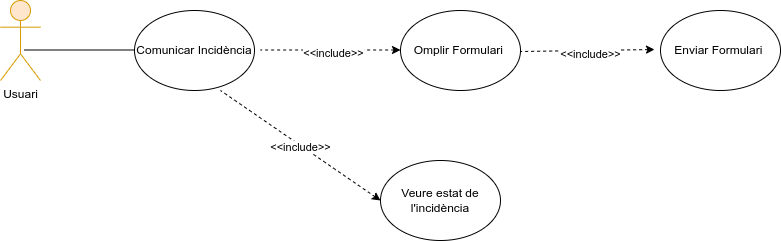
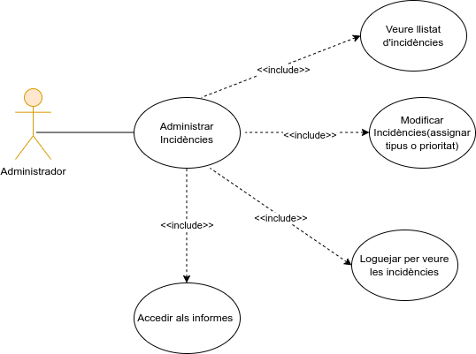
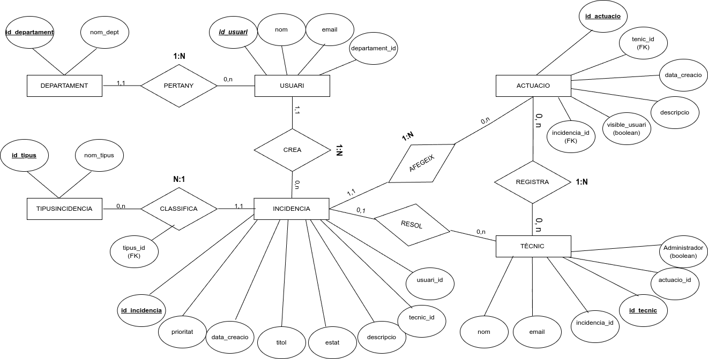
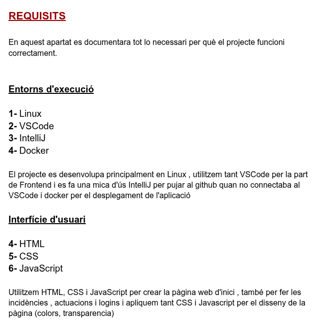
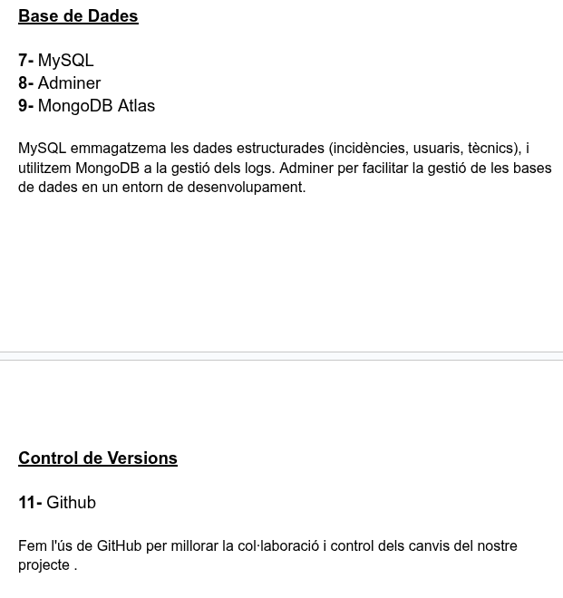
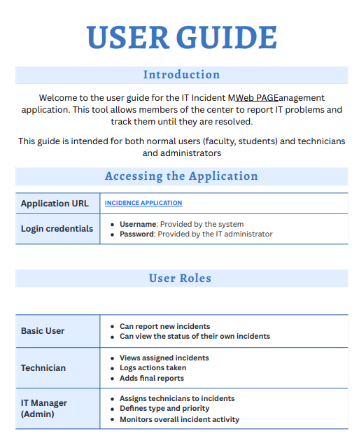
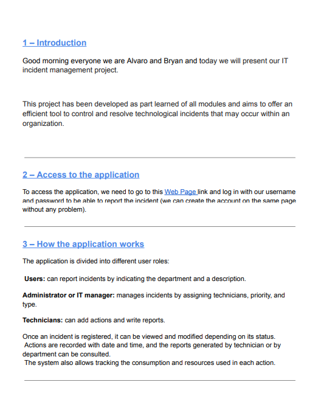
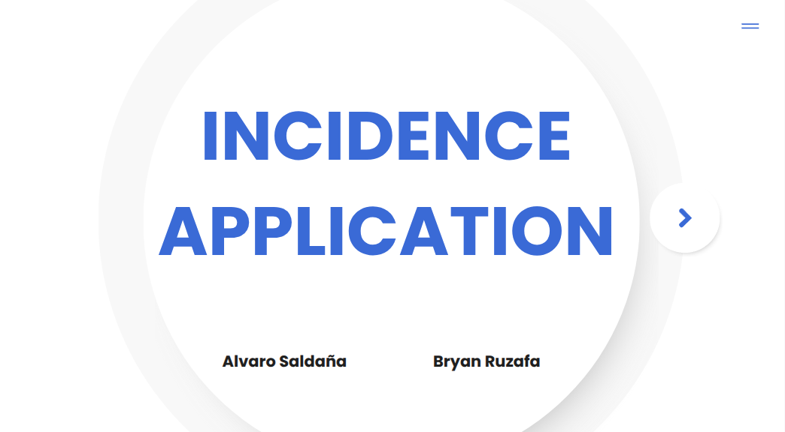

<h1 align="center"> Bones som el grup de Alvaro y Bryan</h1>
<h3 align="center">Formem part del GRUP 10</h3>

Aquest es el disseny del projecte en l'apartat de github  
  

<i>Esperem que us agradi!</i> 🚀
 
 
 

	

<a href="http://g10.daw.inspedralbes.cat/" >ENLLAÇ A LA PÀGINA WEB </a>    
<a href="https://youtu.be/gKVc9uX9Cko?si=m9oVJPVKjmV1oNii" > Per veure el video de la pàgina web aquí </a>    
<a href="https://www.figma.com/design/PFRyiarCOdoHD00SgUn9Gq/WireFrame?node-id=0-1&t=uxsPoFSvvXVfqbmq-1">Enllaç Al wireframe</a>    
<a href="https://github.com/inspedralbes/projecte-1daw-24-25-daw1pj-PataPim/tree/main/php">Més informació del codi aquí</a>    

Diagrames del projecte Programació

     
 
  <h2>Diagrames casos d'ús</h2>

	    
  

    <h3>Diagrama Usuari</h3>
    
  
  

  

  

    <h3>Diagrama Tecnic</h3>
    
  

  

  

    <h3>Diagrama Administrador</h3>
    
  

BBDD

    

  <h2>Esquema Model E-R</h2>
  

SISTEMES 

    

  <h2>Diagrama Arquitectura Sistema</h2>
  

  <h2> Requisits Bàsics per a l'execució de l'aplicació</h2>
  

  

ANGLÈS 

    

  <h2> Requisits Bàsics per a l'execució de l'aplicació</h2>
  

  

  

 
 
 
 
 
 
 

Fes click aquí sobre ,per veure l'historial del projecte

     

<strong>22/04/2025</strong>   

En aquest dia creem el Taiga i el grup en el repositori de github també creem el disseny de tot el github per tenir una bona presentacio dels diagrames

    

 <strong>23/04/2025</strong>   

 Vam crear els diagrames de casos d'us i els vaig pujar al github i començem l'esquema de pantalles (wireframe) 
    

 <strong>24/04/2025</strong>   

 Treballem el el model E-R y conceptual de la base de dades del usuaris tècnics,administrador acabem l'esquema de pantalles de les incidències 
    

 <strong>25/04/2025</strong>   

 Convertim el model E-Rconceptual de la base de dades a model Relacional (Creació de taules a la base de dades) i planifiquem el Sprint 1 que farem la setmana vinent
    

<strong>28/04/2025</strong>   

 Vam començar a crear la pàgina d’inici amb HTML, CSS i Bootstrap per fer-la responsive, i vam iniciar la connexió amb la base de dades mitjançant PHP. També es van modificar els repositoris a GitHub i es van penjar els arxius de Docker i els esquemes de la base de dades.
    

<strong>29/04/2025</strong>   

Vam continuar treballant en el landing page i en la connexió PHP amb la base de dades, es va crear la taula d’incidències i es van penjar a GitHub els esquemes de pantalla i els fitxers de connexió.
    

<strong>30/04/2025</strong>   

 Es van crear els fitxers PHP per establir la connexió amb la base de dades i gestionar la creació d’incidències, es van crear totes les taules a la base de dades i es va configurar el compte al clúster per a la connexió, verificant que tot funcionés correctament amb els contenidors de Docker.
    

<strong>05/05/2025</strong>   

Es van crear fitxers PHP per processar i editar incidències, aplicar estils a les pàgines ja fetes i modificar alguns camps de la base de dades per fer-los compatibles amb PHP. A més, es va connectar Docker amb Adminer i Apache2 i es va iniciar el SPRINT 2.
    

<strong>06/05/2025</strong>   

 Es va finalitzar el fitxer editar_incidencia.php, permetent modificar incidències i guardar-ne els canvis, i es va crear l’esquema tècnic del projecte amb la documentació dels requisits bàsics per a la seva execució.
    

<strong>07/05/2025</strong>   

 Es va acabar el fitxer delete_incidencia.php i es va iniciar el desenvolupament de documentar_incidencia.php, penjant l’esquema corresponent amb els requisits per a l’execució de l’aplicació. També es va gestionar el compte de MongoDB i es va preparar per emmagatzemar els logs del sistema.
    

<strong>08/05/2025</strong>   

 Es va finalitzar el fitxer documentar_incidencia.php, s’hi va afegir un formulari inicial per a l’edició del contingut de les incidències i es va crear el fitxer consulta_incidencia.php.
    

<strong>09/05/2025</strong>   

 Es va finalitzar la consulta d’incidències i es va començar a desenvolupar la part de gestió de tècnics també es va continuar treballant en tots els fitxers relacionats amb la gestió de tècnics.
    

<strong>12/05/2025</strong>   

 Es va crear el fitxer login.php, s’actualitzà la base de dades per implementar el camp contrasenya a diverses taules i es van implementar les sessions per als diferents usuaris.
    

<strong>13/05/2025</strong>   

 Es va fer la connexió a MongoDB Atlas en producció i es van registrar els primers logs a la base de dades, incloent-hi la URL, l’usuari i el timestamp. També es va implementar el middleware i la connexió Mongo Express per visualitzar els logs.
    

<strong>14/05/2025</strong>   

Es van millorar els estils CSS de les pàgines i es va crear un menú d’usuari. També es van crear dues pàgines, veurelogs.php i estadistiques.php, que permeten visualitzar els logs i estadístiques del sistema.
    

<strong>15/05/2025</strong>   

Es va implementar MongoDB en producció de manera definitiva i es van ajustar els estils CSS, aplicant dissenys de Bootstrap a les pàgines veurelogs.php i estadistiques.php.
    

<strong>16/05/2025</strong>   

 Es va redactar i finalitzar el document de guia d’usuari (user guide).
    

 
 
 
 
 
 
 
 
 
 
 
 

<h3>Enllanços per trobar més informació sobre el projecte</h3>

 
 

 

<h3>Aplicacions utilitzades per al projecte </h3> 

 
     
     
     
    
       

